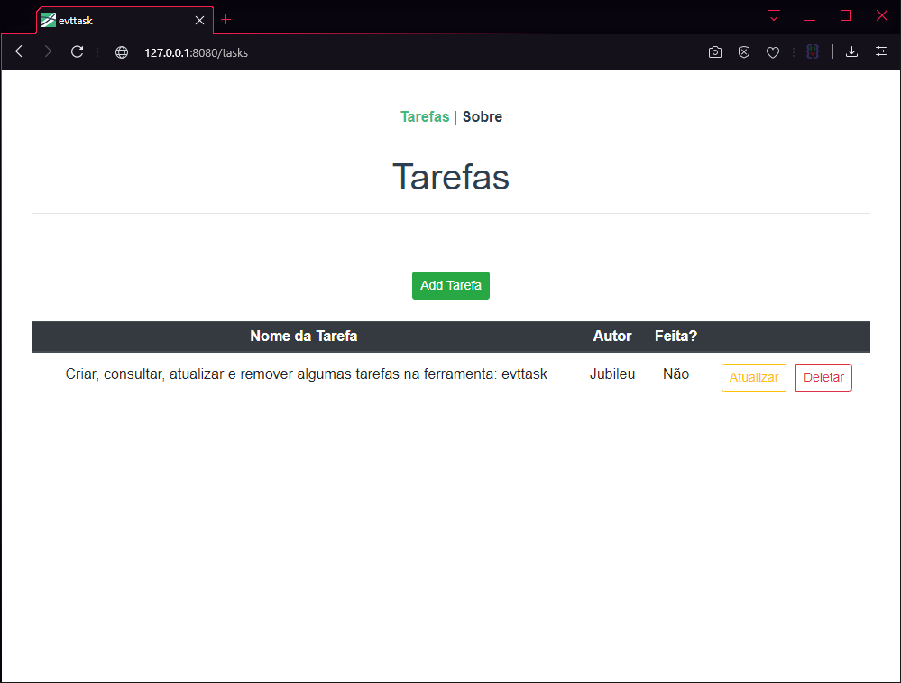

# evttask

### Feito com Vue CLI para executar operações básicas de um CRUD por meio de uma API RESTful com Flask.

## Tecnologia utilizadas neste projeto:
- Python3
- Flask
- Flask-CORS
- npm
- Vue / Vue CLI
- Axios

